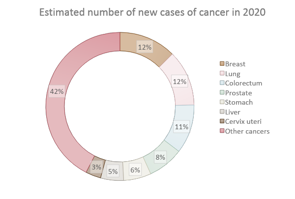
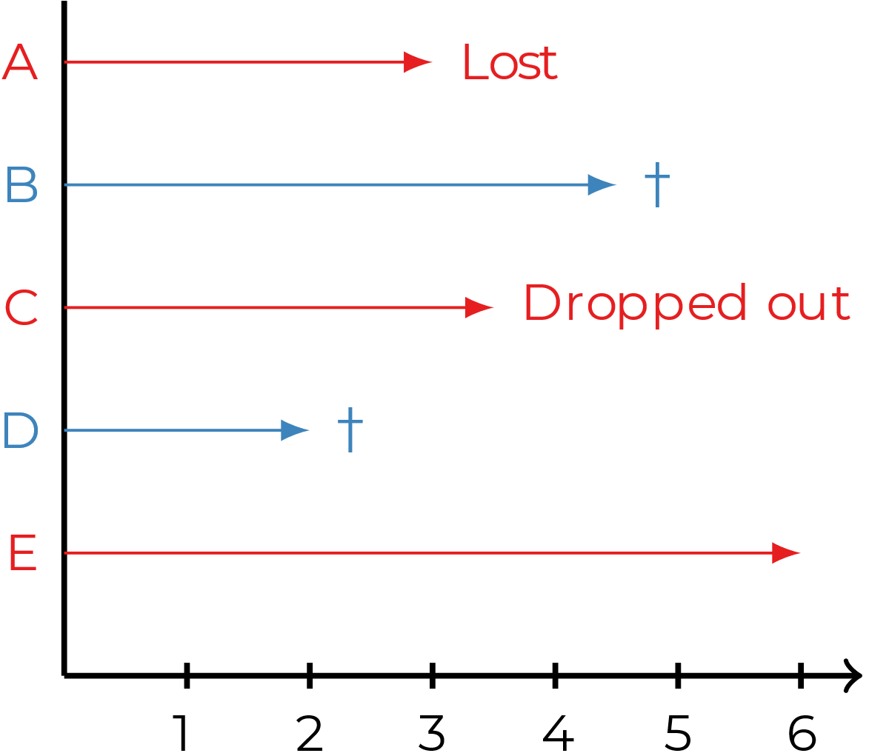
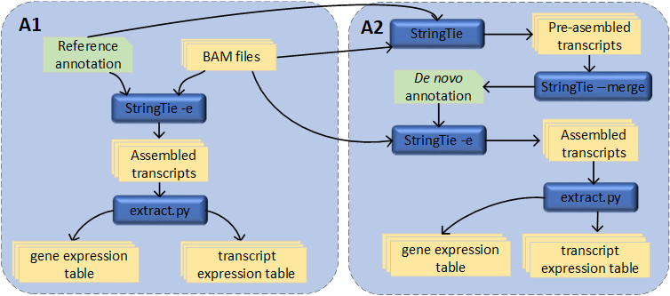
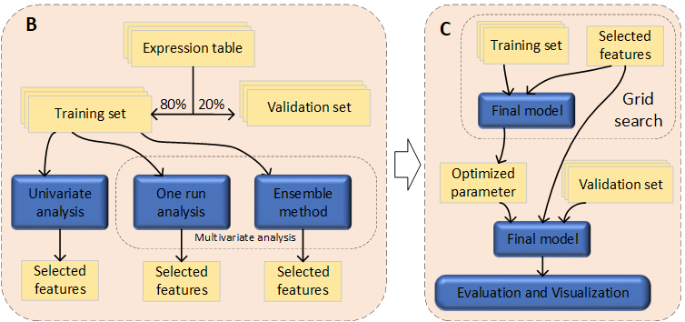
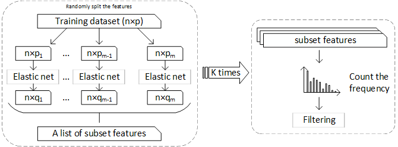
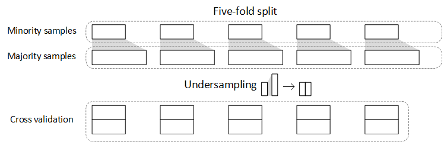
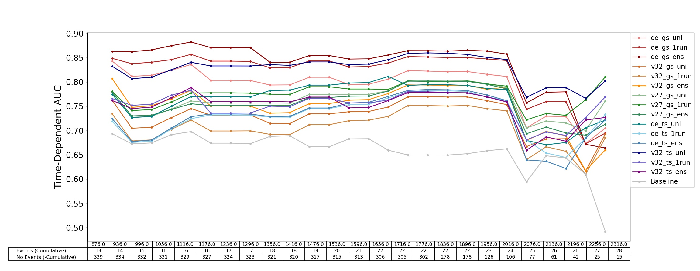
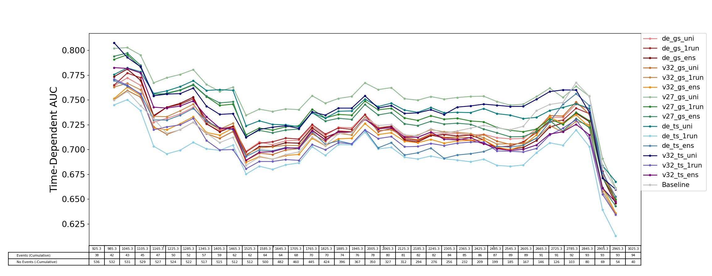

# Development and comparison of feature-selection pipelines for predicting patient outcome from RNA-seq data in breast cancer (60-credit)

The aims of this project:

* To predict patient outcomes based on gene and transcript expression.
* To explore and improve methods for feature selection which extract the informative genes/transcripts associated with breast cancer relapse.

With the aim to select informative features associated with breast cancer patient outcomes, a customized ensemble feature selection model based on penalized Cox proportional hazards (PH) model was developed and compared with the univariate method and single-run Cox PH model. This method can be employed to select features in unbalanced, ultra-high-dimensional, time-to-event data.

## Introduction

### Breast cancer



Breast cancer overtaking lung cancer became the most common cancer worldwide. In 2020, 2.26 million new cases and 685 000 deaths were caused by breast cancer, which was the fifth leading cause of cancer death.

### SCAN-B

[The Sweden Cancerome Analysis Network–Breast (SCAN-B) Initiative](https://pubmed.ncbi.nlm.nih.gov/25722745/)  was initially proposed in 2009 and began enrolling patients in 2010. Within SCAN-B, breast tumors from hospitals across a wide geography of Sweden are routinely being processed and RNA-sequenced. Up to now, more than 17 thousand patients have been enrolled in SCAN-B, and more than 11 thousand tumors have been RNA-sequenced, which provides a rich resource for breast cancer research. To our current knowledge, SCAN-B is the largest RNA-seq breast cancer study in the world!

### Survival analysis and time to event data

Survival analysis is a type of regression problem which tries to establish a connection between covariates and the time of an event. Here the definition of the start point is usually the date of primary treatment. But in SCAN-B, the start point is the date of diagnosis. As for the endpoint, according to the specific question, it can be **overall survival**  (OS) which includes all kinds of death events, **relapse-free survival** (RFS), which includes death and relapse event, and **recurrence-free interval** (RFi), which includes recurrence events only. 

A common issue in survival analysis is that the data is censored.



The events for patients B and D are recorded. But for patients A, C, and E, the only available information is they are event-free up to their last follow-up. So they are censored.

## MATERIALS AND USAGE

### Materials

The breast cancer data is obtained form SCAN-B, which contains **2874 ER+/HER2- samples**, which are used to predict patient outcomes.

|                 | **RFi event** | **RFi event** | **RFi event** | **RFi event** |
| :-------------: | :-----------: | :-----------: | :-----------: | :-----------: |
|                 |     Train     |  Validation   |     Train     |  Validation   |
|   With event    |      116      |      27       |      342      |      95       |
|  Without event  |     1139      |      339      |     1957      |      480      |
| Censoring ratio |     90.8%     |     92.6%     |     85.1%     |     83.5%     |

### Usage

All the scripts are stored in `scripts` and managed with *Snakemake*.  It is recommend to use cluster to carry out the project.

How to start:

```bash
# A conda enviorment is available in '/env/ballgown'
# Unpack environment into directory `ballgown`
cd env
mkdir -p ballgown
tar -xzf ballgown.tar.gz -C ballgown
# Activate the environment.
source ballgown/bin/activate
# Cluster execution
snakemake --profile lsens
```

Workflow design

* *de novo* assembly pipeline




A1: The StringTie expression estimation mode (-e). The reference annotation file is recored, the main output file is a gene abundances file. With this option, no "novel" transcript assemblies (isoforms) will be produced, and read alignments not overlapping any of the given reference transcripts will be ignored.

A2: The StringTie merge function. Without -e option, StringTie generates pre-assembled transcripts for each sample, all the reads will be taken into consideration. Then use the merge function to generate a nonredundant GTF file that contains the de novo transcripts information. Next, estimate the expression of novel transcripts with *de novo* assembly annotation file, and `script/extract.py` is used to extract the FPKM of the gene and transcript into a specific format.

* Workflow design



**Univariate method:** In `script/cox_unitest.py`, `CoxPHFitter()` is used to test the features one by one and selects the significant features based on the adjusted p-value (`script/RDR.R`).

**One run analysis:** In  `script/one_run.py`, `CoxnetSurvivalAnalysis()` is used to select features once. The LASSO ratio of the Elastic Net is set to 0.9.

**Ensemble method:** In`script/pre_selection.py`,   a **customized selection model** using the elastic net penalized cox model as the based learner is designed, to processing ultra-high dimensional data.

The selected feature lists are named `label-best.feature`

### Ensemble method



When processing ultra-high-dimensional data, the high-lasso-ratio elastic net method becomes unstable. That is why we want to use the idea of the ensemble method to avoid this issue. Firstly, the features are **randomly** split into **m** groups, where **m** is based on the number of features **n** divided by the number of samples **p**. This “square” data then is inputted into the base learner which consists of 90% LASSO and 10% Ridge. Each base learner carries out a selection and is adjusted by age and treatment, summarizing all the results from all the base learners. One round selection is finished. To cover the combination of features split into a random subgroup as more as possible, this selection needs to be repeated k times. After collecting all the selected features from k iterations, **the feature-selected frequency** is counted. A cutoff is defined by the ratio of the maximum frequency, which is considered to be a hyper-parameter and can be used to improve the performance of model.



In order to prevent overfitting, the samples with true events and false events are split into five folds respectively with a global fixed random status to make each base learner comparable. And to deal with unbalanced data, the false events in each fold are randomly excluded to end up with the same number of events as the corresponding true events fold. This random undersampling is performed for each base learner to make the best use of all the false-event samples. 

## RESULTS

### RFi (recurrence-free interval) prediction



All feature selection methods give a better performance than baseline, especially the two red lines from de novo gene set and the blue line using transcripts dataset.

### RFS (relapse-free survival) prediction



Performance on gene set and transcript set is close. The feature sets selected by the univariate method (the green lines) are considerably better than baseline and others.

## Conclusion

* It is possible to use transcript expression levels to predict the patient outcome, but the collinearity is an issue
* Univariate method is a good tool to select the features and can be a good method to reduce the redundancy
* For survival analysis, good quality of labels is the key to a successful prediction
* When processing ultra-high-dimensional data, the one-run method is unstable sometimes which can not select the feature efficiently 
* This project forms a basis for further work on the development of predictive signatures for breast cancer patient outcome

